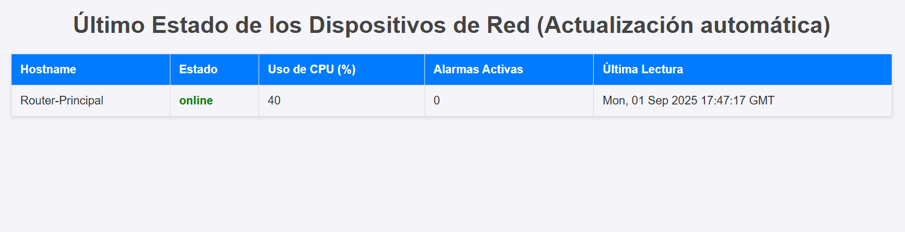

# Mi Monitor de Red 📡

Un sistema simple de monitoreo de salud de red construido con Python, Flask, PostgreSQL y Docker. Este proyecto recolecta datos de dispositivos, los almacena y los presenta en un dashboard web en tiempo real.



## 🛠️ Tecnologías Utilizadas

| Categoría      | Tecnología                                      |
| -------------- | ----------------------------------------------- |
| **Backend** | Python, Flask, Gunicorn                         |
| **Base de Datos**| PostgreSQL                                      |
| **Frontend** | HTML, CSS (plantilla Jinja2)                     |
| **Contenedores** | Docker, Docker Compose                           |

---

## 🚀 Cómo Ejecutar (Método Recomendado con Docker)

Este es el método más simple y rápido para poner en marcha el proyecto. Solo necesitas tener **Docker** y **Docker Compose** instalados.

1.  **Clona el repositorio:**
    ```sh
    git clone [https://github.com/jsavinong/mi_monitor_red.git](https://github.com/jsavinong/mi_monitor_red.git)
    cd mi_monitor_red
    ```

2.  **Levanta los servicios:**
    Este único comando construirá las imágenes, creará la base de datos, ejecutará el script `init.sql` y pondrá en marcha la aplicación.
    ```sh
    docker-compose up --build
    ```

3.  **Accede al dashboard:**
    - Abre **[http://localhost:5001](http://localhost:5001)** en tu navegador. ¡Listo!

---

## ⚙️ Cómo Ejecutar (Método Manual para Desarrollo)

Este método es útil si quieres trabajar directamente sobre el código sin reconstruir los contenedores.

**Requisitos:**
- Python 3.8+
- PostgreSQL (corriendo localmente)
- Git

**Pasos:**

1.  **Clona el repositorio** (si aún no lo has hecho):
    ```sh
    git clone [https://github.com/jsavinong/mi_monitor_red.git](https://github.com/jsavinong/mi_monitor_red.git)
    cd mi_monitor_red
    ```

2.  **Crea y activa un entorno virtual:**
    ```sh
    # En Windows
    python -m venv venv
    venv\Scripts\activate

    # En Mac/Linux
    python3 -m venv venv
    source venv/bin/activate
    ```

3.  **Instala las dependencias:**
    ```sh
    pip install -r requirements.txt
    ```

4.  **Configura las variables de entorno:**
    Crea un archivo `.env` con los datos de tu base de datos PostgreSQL local.
    ```
    DB_HOST=localhost
    DB_NAME=mi_monitor_red
    DB_USER=tu_usuario_de_postgres
    DB_PASSWORD=tu_contraseña_de_postgres
    ```

5.  **Prepara la base de datos:**
    Asegúrate de haber creado una base de datos llamada `mi_monitor_red` y luego ejecuta el script `init.sql` para crear la tabla necesaria:
    ```sh
    psql -U tu_usuario_de_postgres -d mi_monitor_red -f init.sql
    ```

6.  **Ejecuta la aplicación:**
    ```sh
    python app.py
    ```

---

## Licencia

Este proyecto está bajo la Licencia MIT.